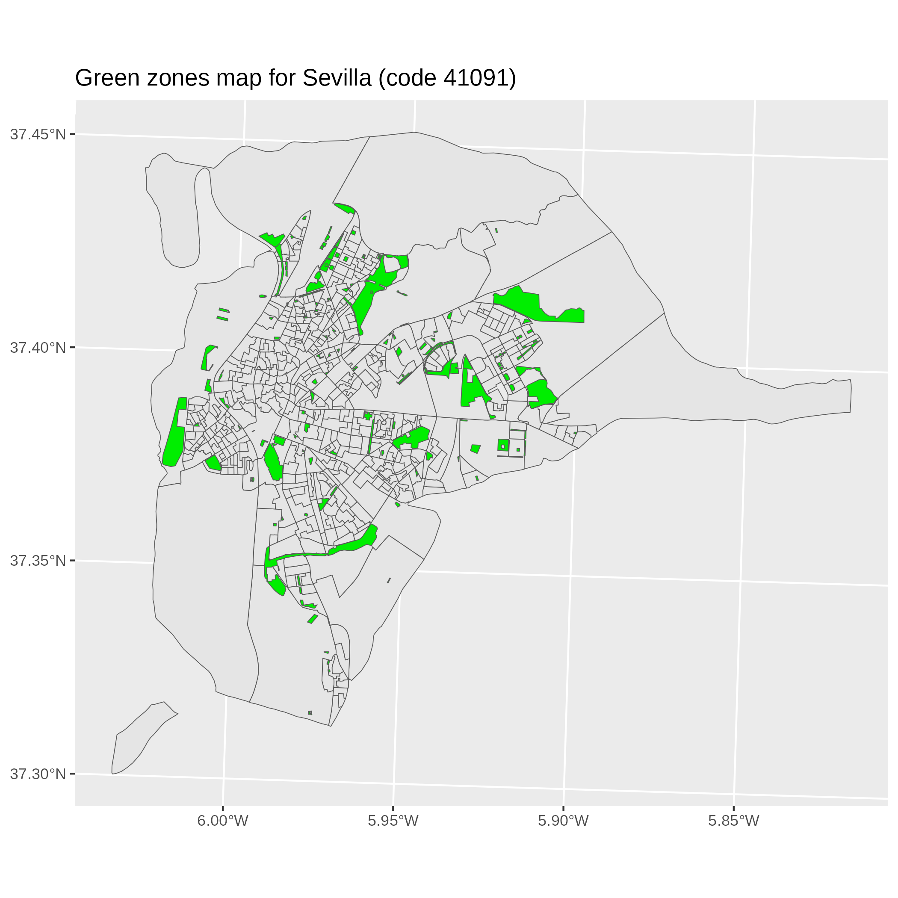
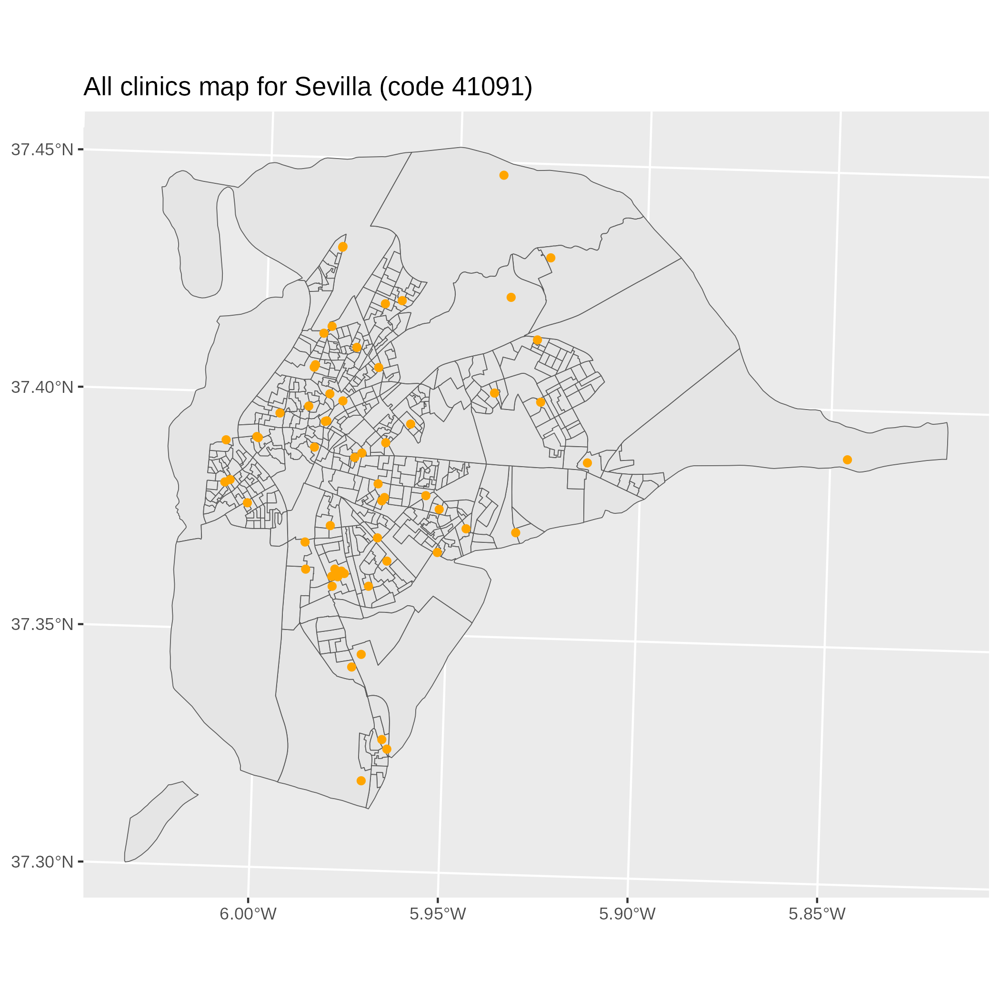

```{r, include = FALSE}
knitr::opts_chunk$set(
  collapse = TRUE,
  comment = "#>"
)
```

<!--```{r setup}
library(fairgwr)
```-->
# Introduction
This is the part of the `fairgwr` package providing a way to retrieve data in
the same format used by the package's functions.

The `data-raw` folder contains simple scripts aiding in the download an processing
of raw data from INE and IECA sources.

A convention commonly used throughout the entire `fairgwr` package is the `CITY_CODE`
or `ct_code` variable. This is a 5-digit code referring to the municipality code as
defined by Spain's _National Institute of Statistics (INE)_. A comprehensive list of codes
for every Spanish municipality can be found at <https://www.ine.es/daco/daco42/codmun/codmun11/11codmunmapa.htm>.

## Running
Check we have the needed dependencies:
```{r eval=FALSE}
install.packages(c("sf", "readxl", "osrm", "ggplot2", "yaml"))
```

Setting `data-raw` as our working directory, we can run the preprocessing file as:
```{r eval=FALSE}
setwd("data-raw")
source("preprocess.R")
```
This will download the needed data (if missing), process it, and output
an object containing:

* **x**: an $(n\times p+1)$ data frame with $\mathbf{1}$ as first column
* **xnorm**: same as **x** but with normalized data
* **y**: the observed values of $y$
* **raw**: the initial values for $x$ and $y$ along with their geographical data
* **geometry**: geographical data as a `sfc` object
* **gz**: geographical data for green zones, for plotting purposes
* **clinic_any**: geographical data for all clinics
* **clinic_public**: geographical data for public clinics

Some parameters that may need adjusting before running are:

* `CITY_CODE` (line 7): the municipality code as explained in _Introduction_
* `OSRM_URL` (lines 8-9): the URL for the OSRM server we'll be using (see _Routing_).
By default, it is expected one is running locally, but using a public instance is
also possible
* `DIST_TYPE` (lines 10-12): whether we want $y$ to be the _average_ (default),
_minimum_ or _maximum_ of all distances from every census tract to the
determined locations
* `LOCATIONS` (lines 13-15): one of "parks", "clinics_any" or "clinics_public",
the locations to which the distances will be measured
* `TRACT_FIX` (lines 17-24): in the case we need to specify new centroids on some
census tracts (i.e. when the population is concentrated in a small area), we can
do so by providing a list with the census tract code and their new location

# Considerations
Given that the $x_3$ _(underage population)_ and $x_7$ _(loneliness index)_
variables are only available via IECA's DERA website, the availability of data
is limited to municipalities within the Spanish region of Andalusia.

## Raw data
Upon first run, the script will download any missing data from some hardcoded
URLs (see `datadl.R`).

Census data is already provided as an Excel file since automating this process
is not currently possible. The source of this data is INE's [_Population and
Housing Census_ website](https://www.ine.es/Censo2021/Inicio.do).

OpenStreetMap data for our region of interest will most likely also be needed,
see below.

## Routing
Since the $y$ variable measures the walking distance from the centroid of
every census tract to the centroid of every desired location (be it parks
or clinics), the euclidean distance can't be used in this context.

These distances are then computed by [OSRM](https://project-osrm.org/), which
will give us the actual walking distance to such points.

Even when the `osrm` package offers a connection with a public OSRM instance,
it usually will reject queries to the table service if they are big enough. In
practice, this means that almost any request made by this script won't be
processed by a public instance.

## Running a local OSRM instance
It is then encouraged to run a local OSRM instance. The easiest and most
convenient way to do so is running a docker container.

First off, we'll need an OpenStreetMap extract for our region of interest. In our
case, we can download the data for the Andalusian region from
[Geofabrik](http://download.geofabrik.de/europe/spain/andalucia-latest.osm.pbf).

Given that docker is installed in our machine
(see [Installing Docker](https://docs.docker.com/engine/install/)),
the osrm-backend container can be pulled:
```{bash eval=FALSE}
docker pull osrm/osrm-backend
```
After this, the pbf data can be extracted and processed using the **foot** profile
```{bash eval=FALSE}
docker run -t -v "${PWD}:/data" ghcr.io/project-osrm/osrm-backend osrm-extract -p /opt/foot.lua /data/andalucia-latest.osm.pbf || echo "osrm-extract failed"
docker run -t -v "${PWD}:/data" ghcr.io/project-osrm/osrm-backend osrm-partition /data/andalucia-latest.osrm || echo "osrm-partition failed"
docker run -t -v "${PWD}:/data" ghcr.io/project-osrm/osrm-backend osrm-customize /data/andalucia-latest.osrm || echo "osrm-customize failed"
```
We are ready to run our container:
```{bash eval=FALSE}
docker run -t -i -p 5000:5000 -v "${PWD}:/data" ghcr.io/project-osrm/osrm-backend osrm-routed --algorithm mld --max-table-size 1000000 /data/andalucia-latest.osrm
```
The `max-table-size` parameter is explicitly defined to avoid having the instance
reject our queries due to their size. Keep in mind, when working with big cities,
OSRM can get quite memory hungry.

More information on `osrm-backend` can be found in the project's [Github](https://github.com/Project-OSRM/osrm-backend).

# Results
When done, the script will generate 4 files in the current working directory:

* an `.rds` file containing all the data as shown in _Running_
* a `.png` image for the green zones map
* a `.png` image for the "all clinics" map
* a `.png` image for the "public clinics" map

{width=45%} {width=45%}
{width=45%}
